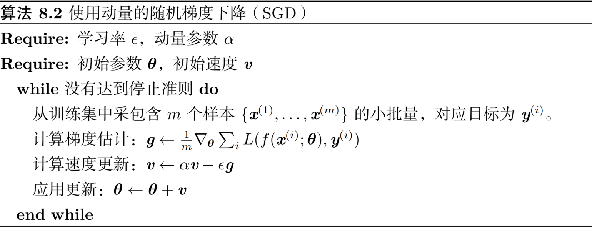
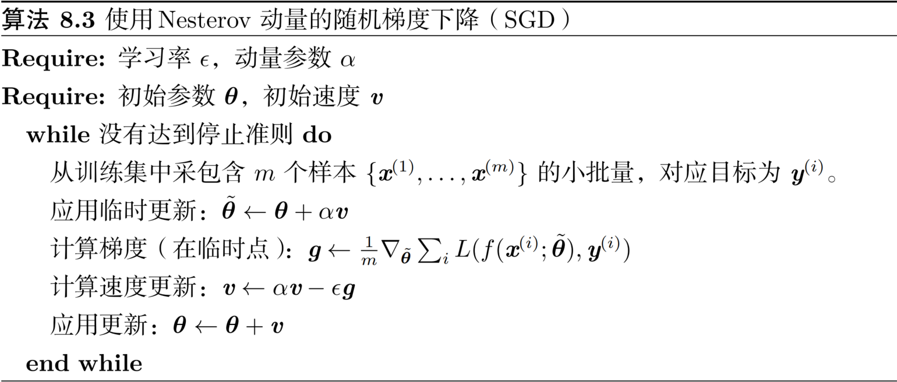

2. 神经网络优化中的挑战
    1. 病态

        病态体现在随机梯度下降会“卡”在某些情况，此时即使很小的更新步长也会增加代价函数
        
        代价函数的二阶泰勒级数展开预测梯度下降中的$−ϵ\mathbf g$会增加$\frac12\epsilon^2\mathbf g^\top T\mathbf g - \epsilon\mathbf g^\top\mathbf g$到代价中。当$\frac12\epsilon^2\mathbf g^\top T\mathbf g$超过$\epsilon\mathbf g^\top\mathbf g$时，梯度的病态会成为问题
    2. 局部极小值：由于**模型可辨识性**问题，神经网络和任意具有多个等效参数化潜变量的模型都会具有多个局部极小值。如果一个足够大的训练集可以唯一确定一组模型参数，那么该模型被称为可辨认的。带有潜变量的模型通常是不可辨认的，因为通过相互交换潜变量我们能得到等价的模型
    3. 高原、鞍点和其他平坦区域
    4. [悬崖和梯度爆炸](gradient_clipping.py)：多层神经网络通常存在像悬崖一样的斜率较大区域。这是由于几个较大的权重相乘导致的。遇到斜率极大的悬崖结构时，梯度更新会很大程度地改变参数值，通常会完全跳过这类悬崖结构
    5. 长期依赖：当计算图变得极深时，神经网络优化算法会面临的另外一个难题就是长期依赖问题——由于变深的结构使模型丧失了学习到先前信息的能力，让优化变得极其困难
3. 基本算法
    1. [随机梯度下降](sgd.ipynb)
        - 保证SGD收敛的一个充分条件是$\sum_{k = 1}^\infty\epsilon_k = \infty$且$\sum_{k = 1}^\infty\epsilon_k^2 < \infty$
        
            实践中，一般会线性衰减学习率直到第$\tau$次迭代：
            $$\epsilon_k = (1 - \alpha)\epsilon_0 + \alpha\epsilon_\tau$$
    2. [动量](momentum_optimization.py)
        
        从形式上看，动量算法引入了变量$\mathbf v$充当速度角色——它代表参数在参数空间移动的方向和速率。速度被设为负梯度的指数衰减平均。更新规则如下：
        $$\mathbf v \leftarrow \alpha\mathbf v - \epsilon\nabla_{\mathbf\theta}(\frac1m\sum_{i = 1}^mL(f(\mathbf x^{(i)}; \mathbf\theta), \mathbf y^{(i)})) \\
        \mathbf\theta \leftarrow \mathbf\theta + \mathbf v$$
        - 步长大小：$\frac{\epsilon\|\mathbf g\|}{1 - \alpha}$
    3. [Nesterov动量](nesterov.py)
        $$\mathbf v \leftarrow \alpha\mathbf v - \epsilon\nabla_{\mathbf\theta}(\frac1m\sum_{i = 1}^mL(f(\mathbf x^{(i)}; \mathbf\theta + \alpha\mathbf v), \mathbf y^{(i)})) \\
        \mathbf\theta \leftarrow \mathbf\theta + \mathbf v$$
        Nesterov动量和标准动量之间的区别体现在梯度计算上。Nesterov动量中，梯度计算在施加当前速度之后。因此，Nesterov动量可以解释为往标准动量方法中添加了一个校正因子
        
        在凸批量梯度的情况下，Nesterov动量将额外误差收敛率从$O(1 / k)$（k 步后）改进到$O(1/k^2)$。可惜，在随机梯度的情况下，Nesterov动量没有改进收敛率
5. 自适应学习率算法
    1. [AdaGrad](adagrad.py)
        - 独立地适应所有模型参数的学习率，缩放每个参数反比于其所有梯度历史平方值总和的平方根
        
    2. [RMSProp](rmsprop.py)
        - 改变梯度积累为指数加权的移动平均
       
    3. [Adam](adam_optimization.ipynb)
        - 首先，在Adam中，动量直接并入了梯度一阶矩（指数加权）的估计。将动量加入RMSProp最直观的方法是将动量应用于缩放后的梯度。其次，Adam包括偏置修正，修正从原点初始化的一阶矩（动量项）和（非中心的）二阶矩的估计
       
6. 二阶近似方法
    $$J(\mathbf\theta) = \mathbb E_{\mathbf x, y \sim \hat p_{\mathrm{data}}(\mathbf x, y)}[L(f(\mathbf x; \mathbf\theta), y)] = \frac1m\sum_{i= 1}^mL(f(\mathbf x^{(i)}; \mathbf\theta), y^{(i)})$$
    1. 牛顿法
        $$J(\mathbf\theta) \approx J(\mathbf\theta^{(0)}) + (\mathbf\theta - \mathbf\theta^{(0)})^\top\nabla_{\mathbf\theta}J(\mathbf\theta^{(0)}) + \frac12(\mathbf\theta - \mathbf\theta^{(0)})^\top H(\mathbf\theta^{(0)})(\mathbf\theta - \mathbf\theta^{(0)}) \Rightarrow \mathbf\theta^* = \mathbf\theta_0 - H^{-1}\nabla_{\mathbf\theta}J(\mathbf\theta)$$
        在深度学习中，目标函数的表面通常非凸（有很多特征），如鞍点。因此使用牛顿法是有问题的。如果Hessian矩阵的特征值并不都是正的，例如，靠近鞍点处，牛顿法实际上会导致更新朝错误的方向移动。这种情况可以通过正则化Hessian矩阵来避免。常用的正则化策略包括在Hessian矩阵对角线上增加常数$\alpha$。正则化更新变为$\mathbf\theta^* = \mathbf\theta_0 - (H(f(\mathbf\theta_0)) + \alpha I)^{-1}\nabla_{\mathbf\theta}J(\mathbf\theta)$
       

[返回](readme.md)