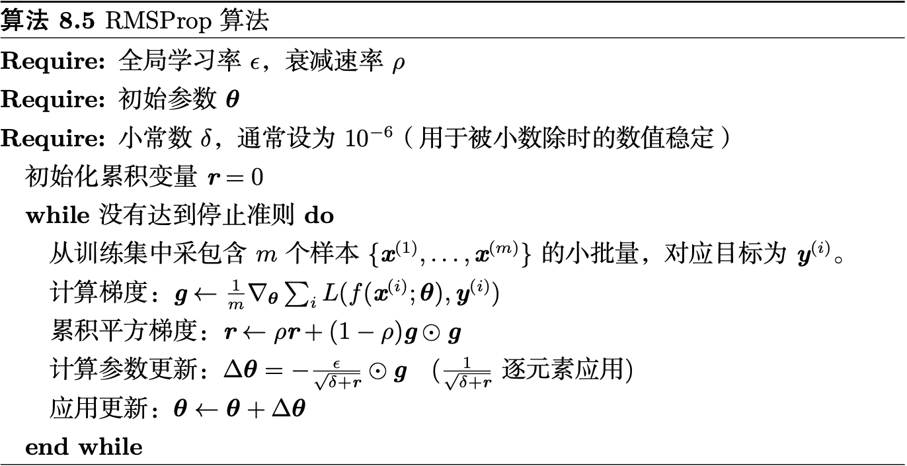
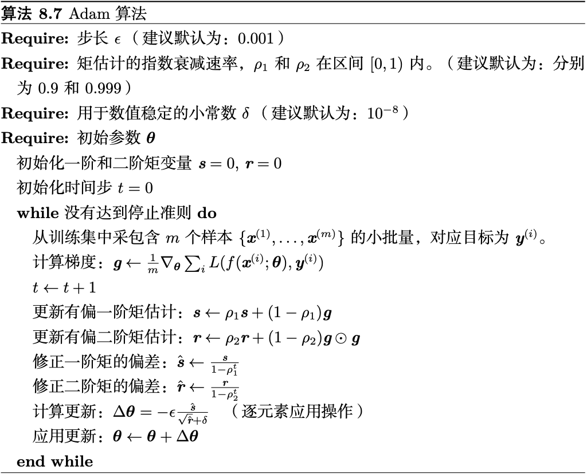
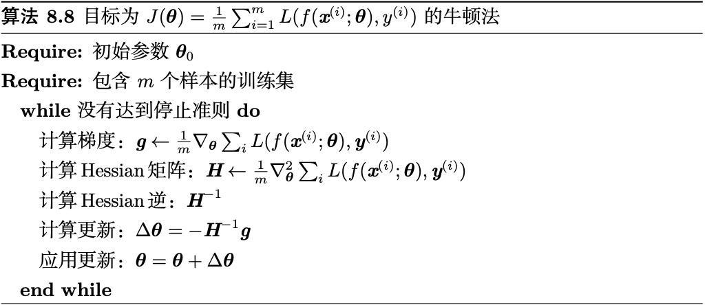

3. 基本算法
    1. [随机梯度下降](sgd.ipynb)
        - 保证SGD收敛的一个充分条件是$\sum_{k = 1}^\infty\epsilon_k = \infty$且$\sum_{k = 1}^\infty\epsilon_k^2 < \infty$
        
            实践中，一般会线性衰减学习率直到第$\tau$次迭代：
            $$\epsilon_k = (1 - \alpha)\epsilon_0 + \alpha\epsilon_\tau$$
    2. 动量

        从形式上看，动量算法引入了变量$\mathbf v$充当速度角色——它代表参数在参数空间移动的方向和速率。速度被设为负梯度的指数衰减平均。更新规则如下：
        $$\mathbf v \leftarrow \alpha\mathbf v - \epsilon\nabla_{\mathbf\theta}(\frac1m\sum_{i = 1}^mL(f(\mathbf x^{(i)}; \mathbf\theta), \mathbf y^{(i)})) \\
        \mathbf\theta \leftarrow \mathbf\theta + \mathbf v$$
        - 步长大小：$\frac{\epsilon\|\mathbf g\|}{1 - \alpha}$
5. 自适应学习率算法
    1. AdaGrad
        - 独立地适应所有模型参数的学习率，缩放每个参数反比于其所有梯度历史平方值总和的平方根
        
    2. RMSProp
        - 改变梯度积累为指数加权的移动平均
       
    3. Adam
        - 首先，在Adam中，动量直接并入了梯度一阶矩（指数加权）的估计。将动量加入RMSProp最直观的方法是将动量应用于缩放后的梯度。其次，Adam包括偏置修正，修正从原点初始化的一阶矩（动量项）和（非中心的）二阶矩的估计
       
6. 二阶近似方法
    $$J(\mathbf\theta) = \mathbb E_{\mathbf x, y \sim \hat p_{\mathrm{data}}(\mathbf x, y)}[L(f(\mathbf x; \mathbf\theta), y)] = \frac1m\sum_{i= 1}^mL(f(\mathbf x^{(i)}; \mathbf\theta), y^{(i)})$$
    1. 牛顿法
        $$J(\mathbf\theta) \approx J(\mathbf\theta^{(0)}) + (\mathbf\theta - \mathbf\theta^{(0)})^\top\nabla_{\mathbf\theta}J(\mathbf\theta^{(0)}) + \frac12(\mathbf\theta - \mathbf\theta^{(0)})^\top H(\mathbf\theta^{(0)})(\mathbf\theta - \mathbf\theta^{(0)}) \Rightarrow \mathbf\theta^\ast = \mathbf\theta_0 - H^{-1}\nabla_{\mathbf\theta}J(\mathbf\theta)$$
        在深度学习中，目标函数的表面通常非凸（有很多特征），如鞍点。因此使用牛顿法是有问题的。如果Hessian矩阵的特征值并不都是正的，例如，靠近鞍点处，牛顿法实际上会导致更新朝错误的方向移动。这种情况可以通过正则化Hessian矩阵来避免。常用的正则化策略包括在Hessian矩阵对角线上增加常数$\alpha$。正则化更新变为$\mathbf\theta^\ast = \mathbf\theta_0 - (H(f(\mathbf\theta_0)) + \alpha I)^{-1}\nabla_{\mathbf\theta}J(\mathbf\theta)$
       

[返回](readme.md)