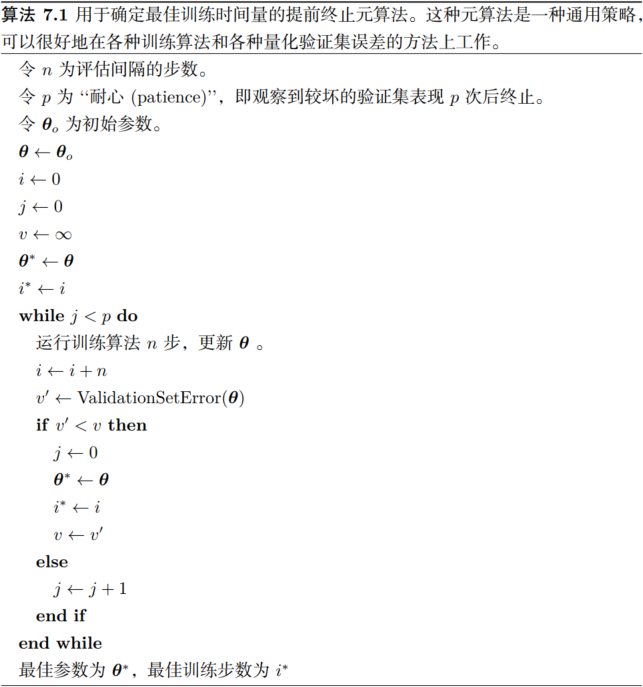
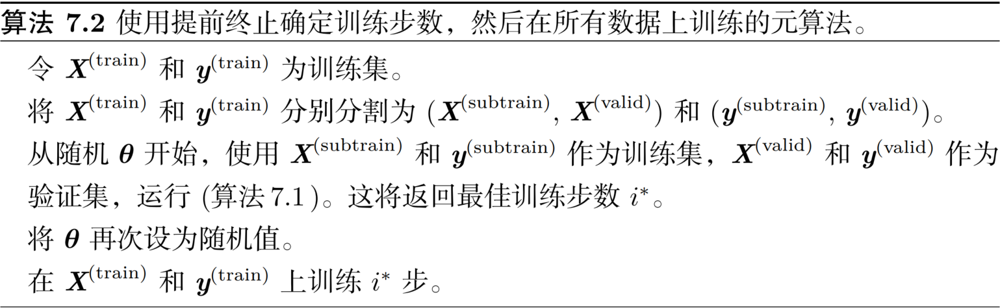
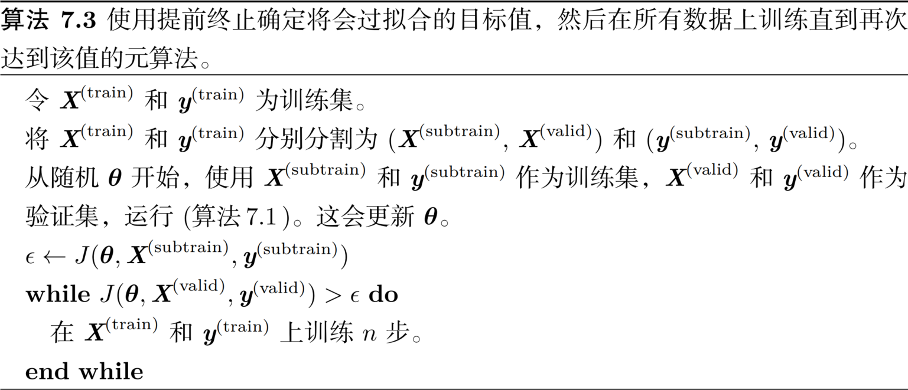

1. [参数范数惩罚](l1_and_l2_regularization.py)：$\tilde J(\mathbf\theta; X, \mathbf y) = J(\mathbf\theta; X, \mathbf y) + \alpha\Omega(\mathbf\theta)$
    1. $L^2$参数正则化
        $$\tilde J(\mathbf w; X, \mathbf y) = \frac\alpha2\mathbf w^\top\mathbf w + J(\mathbf w; X, \mathbf y) \Rightarrow \nabla_{\mathbf w}\tilde J(\mathbf w; X, \mathbf y) = \alpha\mathbf w + \nabla_{\mathbf w}J(\mathbf w; X, \mathbf y) \Rightarrow \mathbf w \leftarrow \mathbf w - \epsilon(\alpha\mathbf w + \nabla_{\mathbf w}J(\mathbf w; X, \mathbf y)) = (1 - \epsilon\alpha)\mathbf w - \epsilon\nabla_{\mathbf w}J(\mathbf w; X, \mathbf y)$$
        $$\mathbf w^* = \argmin_{\mathbf w}J(\mathbf w) \Rightarrow \hat J(\mathbf\theta) = J(\mathbf w^*) + \frac12(\mathbf w - \mathbf w^*)^\top H(\mathbf w - \mathbf w^*) \Rightarrow \nabla_{\mathbf w} J(\mathbf w) = H(\mathbf w - \mathbf w^*)$$
        $$\alpha\tilde{\mathbf w} + H(\tilde{\mathbf w} - \mathbf w^*) = 0 \Rightarrow (H + \alpha I)\tilde{\mathbf w} = H\mathbf w^* \Rightarrow \tilde{\mathbf w} = (H + \alpha I)^{-1}H\mathbf w^* = (Q\Lambda Q^\top + \alpha I)^{-1}Q\Lambda Q^\top\mathbf w^* = [Q(\Lambda + \alpha I)Q^\top]^{-1}Q\Lambda Q^\top\mathbf w^* = Q(\Lambda + \alpha I)^{-1}\Lambda Q^\top \mathbf w^*$$
        我们可以看到权重衰减的效果是沿着由$H$的特征向量所定义的轴缩放$\mathbf w^∗$。具体来说，我们会根据$\frac{\lambda_i}{\lambda_i + \alpha}$因子缩放与$H$第$i$个特征向量对齐的$\mathbf w^∗$的分量
    2. $L^1$参数正则化
        $$\Omega(\mathbf\theta) = \|\mathbf w\|_1 = \sum_i|w_i| \Rightarrow \tilde J(\mathbf w; X, \mathbf y) = \alpha\|\mathbf w\|_1 + J(\mathbf w; X, \mathbf y) \Rightarrow \nabla_{\mathbf w}\tilde J(\mathbf w; X, \mathbf y) = \alpha\mathrm{sign}(\mathbf w) + \nabla_{\mathbf w}J(\mathbf w; X, \mathbf y)$$
        $$\hat J(\mathbf w; X, \mathbf y) = J(\mathbf w^*; X, \mathbf y) + \sum_i[\frac12H_{i, i}(w_i - w_i^*) + \alpha|w_i|] \Rightarrow w_i = \mathrm{sign}(w_i^*)\max\{|w_i^*| - \frac\alpha{H_{i, i}}, 0\}$$
        对每个$i$，考虑$w_i^∗ > 0$的情形，会有两种可能结果：
        
        1. $w_i^∗ \le \frac\alpha{H_{i, i}}$的情况。正则化后目标中的$w_i$最优值是$w_i = 0$。这是因为在方向$i$上$J(\mathbf w; X, \mathbf y)$对$\hat J(\mathbf w; X, \mathbf y)$的贡献被抵消，$L^1$正则化项将$w_i$推至0
        2. $w_i^∗ > \frac\alpha{H_{i, i}}$的情况。在这种情况下，正则化不会将$w_i$的最优值推至0，而仅仅在那个方向上移动$\frac \alpha{H_{i, i}}$的距离

        $w_i^∗ < 0$的情况与之类似，但是$L^1$惩罚项使$w_i$更接近0（增加$\frac \alpha{H_{i, i}}$）或者为0

        相比$L^2$正则化，$L^1$正则化会产生更稀疏的解。此处稀疏性指的是最优值中的一些参数为0
4. 数据集增强

    让机器学习模型泛化得更好的最好办法是使用更多的数据进行训练。当然，在实践中，我们拥有的数据量是很有限的。解决这个问题的一种方法是创建假数据并添加到训练集中。对于一些机器学习任务，创建新的假数据相当简单

    数据集增强对一个具体的分类问题来说是特别有效的方法：对象识别。图像是高维的并包括各种巨大的变化因素，其中有许多可以轻易地模拟

    在神经网络的输入层注入噪声也可以被看作是数据增强的一种方式
8. 提前终止
    在每次验证集误差有所改善后，我们存储模型参数的副本。当训练算法终止时，我们返回这些参数而不是最新的参数。当验证集上的误差在事先指定的循环次数内没有进一步改善时，算法就会终止
    
    提前终止需要验证集，这意味着某些训练数据不能被馈送到模型。为了更好地利用这一额外的数据，我们可以在完成提前终止的首次训练之后，进行额外的训练。在第二轮，即额外的训练步骤中，所有的训练数据都被包括在内。有两个基本的策略都可以用于第二轮训练过程

    一个策略是再次初始化模型，然后使用所有数据再次训练。在这个第二轮训练过程中，我们使用第一轮提前终止训练确定的最佳步数。此过程有一些细微之处。例如，我们没有办法知道重新训练时，对参数进行相同次数的更新和对数据集进行相同次数的遍历哪一个更好。由于训练集变大了，在第二轮训练时，每一次遍历数据集将会更多次地更新参数
    
    另一个策略是保持从第一轮训练获得的参数，然后使用全部的数据继续训练。在这个阶段，已经没有验证集指导我们需要在训练多少步后终止。取而代之，我们可以监控验证集的平均损失函数，并继续训练，直到它低于提前终止过程终止时的目标值。此策略避免了重新训练模型的高成本，但表现并没有那么好。例如，验证集的目标不一定能达到之前的目标值，所以这种策略甚至不能保证终止
    
    **提前终止为何具有正则化效果**：提前终止可以将优化过程的参数空间限制在初始参数值$\mathbf\theta_0$的小邻域内。更具体地，想象用学习率$\epsilon$进行$\tau$个优化步骤（对应于$\tau$个训练迭代）。我们可以将$\epsilon\tau$作为有效容量的度量。假设梯度有界，限制迭代的次数和学习速率能够限制从$\mathbf\theta_0$到达的参数空间的大小。在这个意义上，$\epsilon\tau$的效果就好像是权重衰减系数的倒数
    
[返回](readme.md)