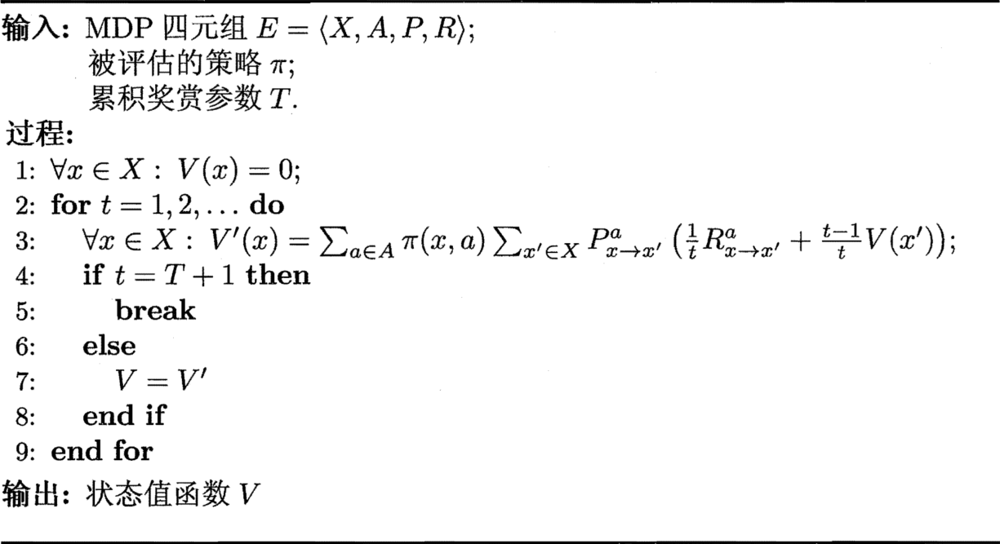
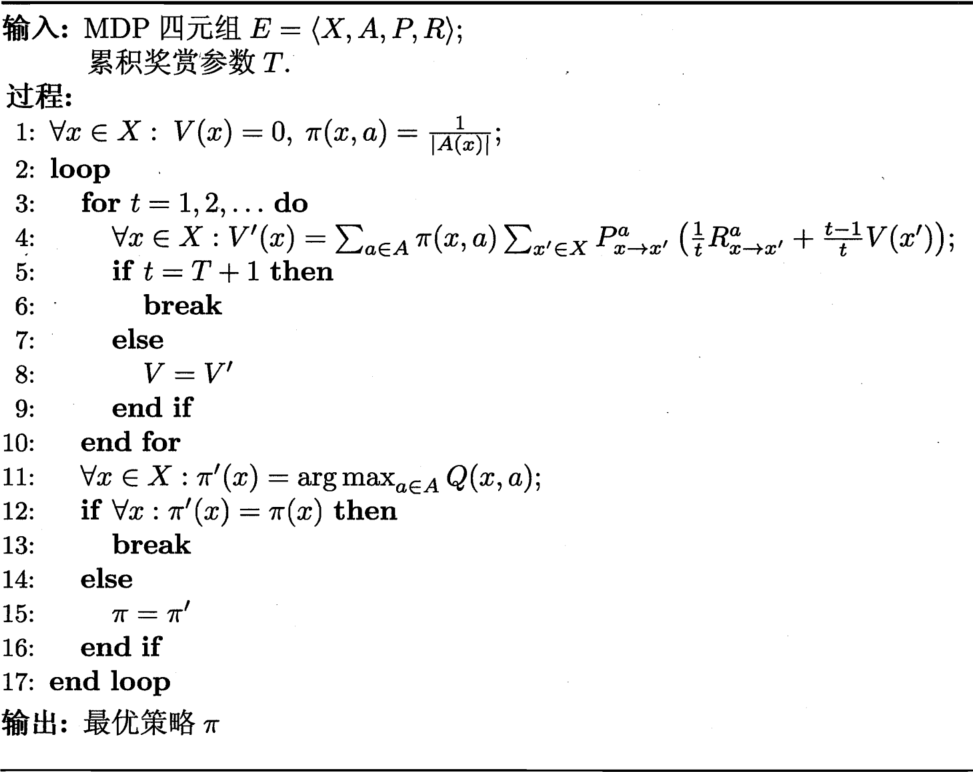
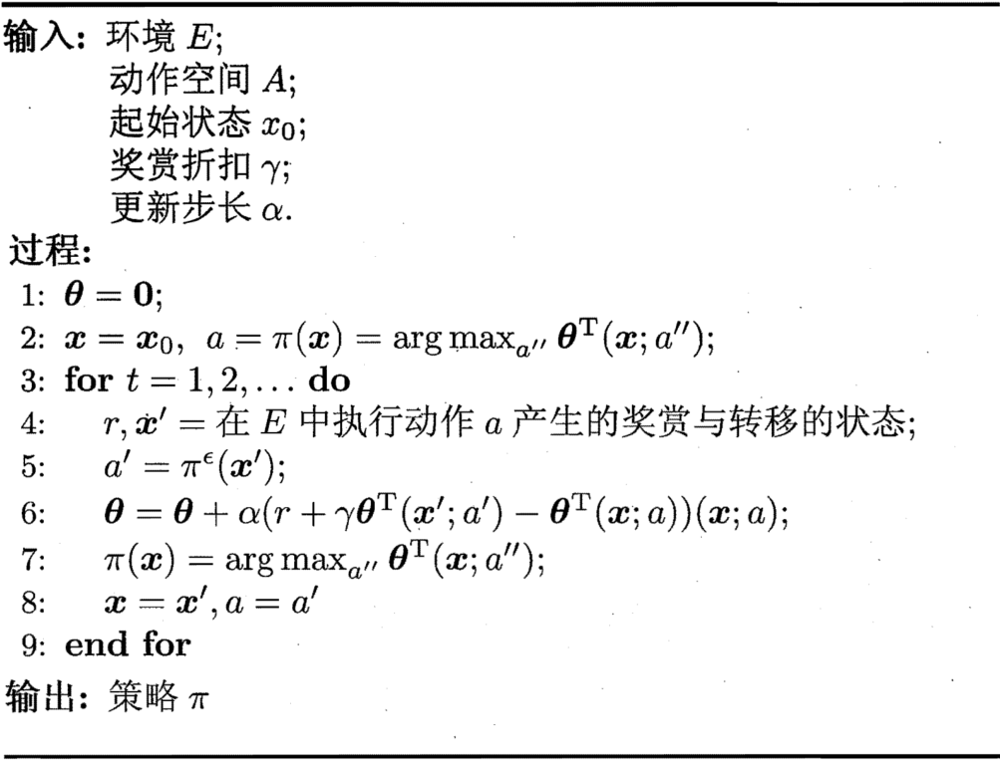

1. 任务与奖赏
    
    强化学习任务通常用[马尔可夫决策过程](markov_decision_process.ipynb)来描述：机器处于环境$E$中，状态空间为$X$，其中每个状态$x \in X$是机器感知到的环境的描述。若某个动作$a \in A$作用在当前状态$x$上，则潜在的转移函数$P$将使得环境从当前状态按某种概率转移到另一个状态；在转移到另一个状态的同时，环境会根据潜在的“奖赏”函数$R$反馈给机器一个奖赏。综合起来，强化学习任务对应了四元组$E = \langle X, A, P, R\rangle$，其中$P: X \times A \times X \rightarrow \mathbb R$指定了状态转移概率，$R: X \times A \times X \rightarrow \mathbb R$指定了奖赏；在有的应用中，奖赏函数可能仅与状态转移有关，即$R: X \times X \rightarrow \mathbb R$

    机器要做的是通过在环境中不断地尝试而学得一个[“策略”$\pi$](policy.ipynb)，根据这个策略，在状态$x$下就能得知要执行的动作$a = \pi(x)$。策略有两种表示方法：一种是将策略表示为函数$\pi: X \rightarrow A$， 确定性策略常用这种表示；另一种是概率表示$\pi: X \times A \rightarrow \mathbb R$，随机性策略常用这种表示$\pi(x, a)$为状态$x$下选择动作$a$的概率，这里必须有$\sum_a\pi(x, a) = 1$

    策略的优劣取决于长期执行这一策略后得到的累积奖赏。长期累积奖赏有多种计算方式，常用的有“T步累积奖赏“$\mathbb E[\frac1T\sum_{t = 1}^Tr_t]$和”$\gamma$折扣累积奖赏“$\mathbb E[\sum_{t = 0}^{+\infty}\gamma^tr_{t + 1}]$，其中$r_t$表示第$t$步获得的奖赏值，$\mathbb E$表示对所有随机变量求期望
2. K-摇臂赌博机
    1. 探索与利用

        这里我们不妨先考虑比较简单的情形：最大化单步奖赏，即仅考虑一步操作。需注意的是，即使在这样的简化情形下，强化学习仍与监督学习有显著不同，因为机器需通过尝试来发现各个动作产生的结果，而没有训练数据告诉机器应当做哪个动作

        实际上，单步强化学习任务对应了一个理论模型，即“K-摇臂赌博机”。K-摇臂赌博机有K个摇臂，赌徒在投入一个硬币后可选择按下其中一个摇臂，每个摇臂以一定的概率吐出硬币，但这个概率赌徒并不知道。赌徒的目标是通过一定的策略最大化自己的奖赏，即获得最多的硬币

        若仅为获知每个摇臂的期望奖赏，则可采用“仅探索”法：将所有的尝试机会平均分配给每个摇臂（即轮流按下每个摇臂），最后以每个摇臂各自的平均吐币橄率作为其奖赏期望的近似估计。若仅为执行奖赏最大的动作，则可采用“仅利用”法：按下目前最优的（即到目前为止平均奖赏最大的）摇臂，若有多个摇臂同为最优，则从中随机选取一个。显然，“仅探索”法能很好地估计每个摇臂的奖赏，却会失去很多选择最优摇臂的机会；“仅利用”法则相反，它没有很好地估计摇臂期望奖赏，很可能经常选不到最优摇臂。因此，这两种方法都难以使最终的累积奖赏最大化

        事实上，“探索”（即估计摇臂的优劣）和“利用”（即选择当前最优摇臂）这两者是矛盾的，因为尝试次数（即总投币数）有限，加强了一方则会自然削弱另一方，这就是强化学习所面临的“探索-利用窘境”。显然，欲累积奖赏最大，则必须在探索与利用之间达成较好的折中
    2. $\epsilon$-贪心
    
        $\epsilon$-贪心法基于一个概率来对探索和利用进行折中：每次尝试时，以$\epsilon$的概率进行探索，即以均匀概率随机选取一个摇臂；以$1 - \epsilon$的概率进行利用，即选择当前平均奖赏最高的摇臂（若有多个，则随机选取一个）

        若摇臂$k$被尝试了$n$次，得到的奖赏为$v_1, v_2, \dots, v_n$，则平均奖赏为$Q(k) = \frac1n\sum_{i = 1}^nv_i$

        显然，更高效的做法是对均值进行增量式计算，即每尝试一次就立即更新$Q(k)$。不妨用下标来表示尝试的次数，初始时$Q_0(k) = O$。对于任意的$n \ge 1$，若第$n - 1$次尝试后的平均奖赏为$Q_{n - 1}(k)$，则在经过第$n$次尝试获得奖赏$v_n$后，平均奖赏应更新为$Q_n(k) = \frac1n((n - 1)Q_{n - 1}(k) + v_n) = Q_{n - 1}(k) + \frac1n(v_n - Q_{n - 1}(k))$
        
    3. Softmax

        Softmax算法中摇臂概率的分配是基于Boltzmann分布$P(k) = \frac{e^\frac{Q(k)}\tau}{\sum_{i = 1}^Ke^\frac{Q(i)}\tau}$
        
        其中，$Q(i)$记录当前摇臂的平均奖赏；$\tau > 0$称为“温度”，$\tau$越小则平均奖赏高的摇臂被选取的概率越高。$\tau$趋于0时Softmax将趋于“仅利用”，$\tau$趋于无穷大时Softmax则将趋于“仅探索”
        
3. 有模型学习

    考虑多步强化学习任务，暂且先假定任务对应的马尔可夫决策过程四元组$E = \langle X, A, P, R\rangle$均为己知，这样的情形称为”模型己知“，即机器已对环境进行了建模，能在机器内部模拟出与环境相同或近似的状况。在己知模型的环境中学习称为”有模型学习“。此时，对于任意状态$x$, $x'$和动作$a$，在$x$状态下执行动作$a$转移到$x'$状态的概率$P_{x \rightarrow x'}^a$是己知的，该转移所带来的奖赏$R_{x \rightarrow x'}^a$也是已知的
    1. 策略评估

        令函数$V^\pi(x)$表示从状态$x$出发，使用策略作所带来的累积奖赏；函数$Q^\pi(x, a)$表示从状态$x$出发，执行动作$a$后再使用策略$\pi$带来的累积奖赏。这里的$V(·)$称为“状态值函数”，$Q(·)$称为“状态动作值函数”，分别表示指定“状态”上以及指定“状态-动作“上的累积奖赏

        由累积奖赏的定义，有状态值函数$
        \begin{cases}
            V_T^\pi(x) = \mathbb E_\pi[\frac1T\sum_{t = 1}^Tr_t | x_0 = x]\text{， }T\text{步累计奖赏} \\
            V_\gamma^\pi(x) = \mathbb E_\pi[\sum_{t = 0}^{+\infty}r_{t + 1} | x_0 = x]\text{， }\gamma\text{折扣累计奖赏}
        \end{cases}
        $

        令$x_0$表示起始状态，$a_0$表示起始状态上采取的第一个动作；对于$T$步累积奖赏，用下标$t$表示后续执行的步数。我们有状态-动作值函数$
        \begin{cases}
            Q_T^\pi(x, a) = \mathbb E_\pi[\frac1T\sum_{t = 1}^Tr_t | x_0 = x, a_0 = a] \\
            Q_\gamma^\pi(x, a) = \mathbb E_\pi[\sum_{t = 0}^{+\infty}r_{t + 1} | x_0 = x, a_0 = a]
        \end{cases}
        $

        由于MDP具有马尔可夫性质，即系统下一时刻的状态仅由当前时刻的状态决定，不依赖于以往任何状态，于是值函数有很简单的递归形式。对于$T$步累积奖赏有$V_T^\pi(x) = \mathbb E_\pi[\frac1T\sum_{t = 1}^Tr_t | x_0 = x] = \mathbb E_\pi[\frac1Tr_1 + \frac{T - 1}T\frac1{T - 1}\sum_{t = 2}^Tr_t | x_0 = x] = \sum_{a \in A}\pi(x, a)\sum_{x' \in X}P_{x \rightarrow x'}^a(\frac1TR_{x \rightarrow x'}^a + \frac{T - 1}T\mathbb E_\pi[\frac1{T - 1}\sum_{t = 1}^{T - 1}r_t | x_0 = x']) = \sum_{a \in A}\pi(x, a)\sum_{x' \in X}P_{x \rightarrow x'}^a(\frac1TR_{x \rightarrow x'}^a + \frac{T - 1}TV_{ T - 1}^\pi(x'))$

        类似的，对于$\gamma$折扣累积奖赏有$V_\gamma^\pi(x) = \sum_{a \in A}\pi(x, a)\sum_{x' \in X}P_{x \rightarrow x'}^a(R_{x \rightarrow x'}^a + \gamma V_\gamma^\pi(x'))$
        

        有了状态值函数$V$，就能直接计算出状态-动作值函数$
        \begin{cases}
            Q_T^\pi(x, a) = \sum_{x' \in X}P_{x \rightarrow x'}^a(\frac1TR_{x \rightarrow x'}^a + \frac{T - 1}TV_{T - 1}^\pi(x')) \\
            Q_\gamma^\pi(x, a) = \sum_{x' \in X}P_{x \rightarrow x'}^a(R_{x \rightarrow x'}^a + \gamma V_\gamma^\pi(x'))
        \end{cases}
        $
    2. [策略改进](policy_gradients.ipynb)
    3. 策略迭代与值迭代

        由前两小节我们知道了如何评估一个策略的值函数，以及在策略评估后如何改进至获得最优策略。显然，将这两者结合起来即可得到求解最优解的方法：从一个初始策略（通常是随机策略）出发，先进行策略评估，然后改进策略，评估改进的策略，再进一步改进策略，……不断迭代进行策略评估和改进，直到策略收敛、不再改变为止。这样的做法称为”策略迭代“
        
        $$
        \begin{cases}
            V_T(x) = \max_{a \in A}\sum_{x' \in X}P_{x \rightarrow x'}^a(\frac1TR_{x \rightarrow x'}^a + \frac{T - 1}TV_{T - 1}(x')) \\
            V_\gamma(x) = \max_{a \in A}\sum_{x' \in X}P_{x \rightarrow x'}^a(R_{x \rightarrow x'}^a + \gamma V_\gamma(x'))
        \end{cases}
        $$
        
        从上面的算法可看出，在模型已知时强化学习任务能归结为基于动态规划的寻优问题。与监督学习不同，这里并未涉及到泛化能力，而是为每一个状态找到最好的动作
4. 免模型学习

    学习算法不依赖于环境建模，则称为争“免模型学习”，这比有模型学习要困难得多
    1. 蒙特卡罗强化学习

        综合起来，在模型未知的情形下，我们从起始状态出发，使用某种策略进行采样，执行该策略$T$步并获得轨迹$<x_0, a_0, r_1, x_1, a_1, r_2, \dots, x_{T - 1}, a_{T - 1}, r_T, x_T>$，然后，对轨迹中出现的每一对状态-动作，记录其后的奖赏之和，作为该状态-动作对的一次累积奖赏采样值。多次来样得到多条轨迹后，将每个状态-动作对的累积奖赏采样值进行平均，即得到状态-动作值函数的估计
        
        然而，我们的策略有可能是确定性的，即对于某个状态只会输出一个动作，若使用这样的策略进行采样，则只能得到多条相同的轨迹。这与$K$摇臂赌博机的“仅利用”法面临相同的问题，因此可借鉴探索与利用折中的办法，例如使用$\epsilon$-贪心法，以$\epsilon$的概率从所有动作中均匀随机选取一个，以$1 - \epsilon$的概率选取当前最优动作。我们将确定性的策略$\pi$称为“原始策略”，在原始策略上使用$\epsilon$贪心法的策略记为
            $$\pi^\epsilon(x) =
            \begin{cases}
            \pi(x), 以概率1 - \epsilon \\
            A中以均匀概率选取的动作, \text{以概率}\epsilon
            \end{cases}$$
        对于最大化值函数的原始策略$\pi = \argmax_aQ(x, a)$，其$\epsilon$-贪心策略$\pi^\epsilon$中，当前最优动作被选中的概率是$1 - \epsilon + \frac{\epsilon}{|A|}$，而每个非最优动作被选中的概率是$\frac\epsilon{|A|}$
        
        同策略蒙特卡罗强化学习算法最终产生的是$\epsilon$-贪心策略。然而，引入$\epsilon$-贪心是为了便于策略评估，在使用策略时并不需要$\epsilon$-贪心；实际上我们希望改进的是原始（非ε$\epsilon$-贪心）策略。那么，能否仅在策略评估时引入$\epsilon$-贪心，而在策略改进时却改进原始策略呢？

        这其实是可行的。不妨用两个不同的策略$\pi$和$\pi'$来产生采样轨迹，两者的区别在于每个“状态-动作对”被采样的概率不同。一般的，函数$f$在概率分布$p$下的期望可表达为$\mathbb E[f] = \int_xp(x)f(x)\mathrm dx \Rightarrow \hat{\mathbb E}[f] = \frac1m\sum_{i = 1}^mf(x)$

        若引入另一个分布$q$，则函数$f$在概率分布$p$下的期望也可等价地写为$\mathbb E[f] = \int_xq(x)\frac{p(x)}{q(x)}f(x)\mathrm dx \Rightarrow \hat{\mathbb E}[f] = \frac1m\sum_{i = 1}^m\frac{p(x_i')}{q(x_i')}f(x_i')$

        回到我们的问题上来，使用策略$\pi$的采样轨迹来评估策略$\pi$，实际上就是对累积奖赏估计期望$Q(x, a) = \frac1m\sum_{i = 1}^mr_i = \frac1m\sum_{i = 1}^m\frac{P_i^\pi}{P_i^{\pi'}}r_i$其中$P_i^\pi$和$P_i^{\pi'}$分别表示两个策略产生第$i$条轨迹的概率。对于给定的一条轨迹$\langle x_0, a_0, r_1, \dots, x_{T - 1}, a_{T - 1}, r_T, x_T \rangle$， 策略$\pi$产生该轨迹的概率为$P^\pi = \prod_{i = 0}^{T - 1}\pi(x_i, a_i)P_{x_i \rightarrow x_{i + 1}}^{a_i}$

        虽然这里用到了环境的转移概率$P_{x_i \rightarrow x_{i + 1}}^{a_i}$但式中实际只需两个策略概率的比值$\frac{P^\pi}{P^{\pi'}} = \prod_{i = 0}^{T - 1}\frac{\pi(x_i, a_i)}{\pi'(x_i, a_i)}$

        若$\pi$为确定性策略而$\pi'$是$\pi$的$\epsilon$-贪心策略，则$\pi(x_i, a_i)$始终为1，$\pi'(x_i, a_i)$为$\frac\epsilon{|A|}$或$1 - \epsilon + \frac\epsilon{|A|}$，于是就能对策略$\pi$进行评估了
        
    2. 时序差分学习

        蒙特卡罗强化学习算法通过考虑采样轨迹，克服了模型未知给策略估计造成的困难。此类算法需在完成一个采样轨迹后再更新策略的值估计，而前而介绍的基于动态规划的策略迭代和值迭代算法在每执行一步策略后就进行值函数更新。两者相比，蒙特卡罗强化学习算法的效率低得多，这里的主要问题是蒙特卡罗强化学习算法没有充分利用强化学习任务的MDP结构。时序差分学习则结合了动态规划与蒙特卡罗方法的思想，能做到更高效的免模型学习

        于状态-动作对$(x, a)$，不妨假定基于$t$个采样己估计出值函数$Q_t^\pi(x, a) = \frac1t\sum_{i = 1}^tr_i$，则在得到第$t + 1$个采样$r_{t + 1}$时，有$Q_{t + 1}^\pi(x, a) = Q_t^\pi(x, a) + \frac1{t + 1}(r_{t + 1} - Q_t^\pi(x, a))$

        更一般的，将$\frac1{t + 1}$替换为系数$\alpha_{t + 1}$，则可将增量项写作$\alpha_{t + 1}$。在实践中通常令$\alpha_t$为一个较小的正数值$\alpha$，若将$Q_t^\pi(x, a)$展开为每步累积奖赏之和，则可看出系数之和为1，即令$\alpha_t = \alpha$不会影响$Q_t$是累积奖赏之和这一性质。更新步长$\alpha$越大，则越靠后的累积奖赏越重要

        $$Q^\pi(x, a) = \sum_{x' \in X}P_{x \rightarrow x'}^a(R_{x \rightarrow x'}^a + \gamma V^\pi(x')) = \sum_{x' \in X}P_{x \rightarrow x'}^a(R_{x \rightarrow x'}^a + \gamma\sum_{a' \in A}\pi(x', a')Q^\pi(x', a'))$$
        通过增量求和可得$Q_{t + 1}^\pi(x, a) = Q_t^\pi + \alpha(R_{x \rightarrow x'}^a - \gamma Q_t^\pi(x', a') - Q_t^\pi(x, a))$
        
        
5. 值函数近似

    假定状态空间为$n$维实数空间$X = \mathbb R^n$，此时显然无法用表格值函数来记录状态值。先考虑简单情形，即值函数能表达为状态的线性函数$V_{\mathbf\theta}(x) = \mathbf\theta^\top\mathbf x$其中$x$为状态向量，$\mathbf\theta$为参数向量。由于此时的值函数难以像有限状态那样精确记录每个状态的值，因此这样值函数的求解被称为值函数近似。
    - 最小二乘误差：$E_\mathbf\theta = \mathbb E_{\mathbf x \sim \pi}[(V^\pi(\mathbf x) - V_\mathbf\theta(\mathbf x))^2] \Rightarrow -\frac{\partial E_\mathbf\theta}{\partial\mathbf\theta} = \mathbb E_{\mathbf x \sim \pi}[2(V^\pi(\mathbf x) - V_\mathbf\theta(\mathbf x))\frac{\partial V_\mathbf\theta(\mathbf x)}{\partial\mathbf\theta}] = \mathbb E_{\mathbf x \sim \pi}[2(V^\pi(\mathbf x) - V_\mathbf\theta(\mathbf x))\mathbf x] \Rightarrow \mathbf\theta = \mathbf\theta + \alpha(V^\pi(\mathbf x) - V_\mathbf\theta(\mathbf x))\mathbf x$

    我们并不知道策略的真实值函数$V^\pi$，但可借助时序差分学习，基于$V^\pi(\mathbf x) = r + \gamma V^\pi(\mathbf x')$用当前估计的值函数代替真实值函数，即$\mathbf\theta = \mathbf\theta + \alpha(r + \gamma V_\mathbf\theta(\mathbf x') - V_\mathbf\theta(\mathbf x))\mathbf x$，其中$\mathbf x'$是下一时刻的状态

    需注意的是，在时序差分学习中需要状态-动作值函数以便获取策略。这里一种简单的做法是令$\mathbf\theta$作用于表示状态和动作的联合向量上，例如给状态向量增加一维用于存放动作编号；另一种做法是用0/1对动作选择进行编码得到向量$\mathbf a = (0; \dots; 1; \dots;0)$，其中“1”表示该动作被选择，再将状态向量与其合并得到$(\mathbf x; \mathbf a)$。这样就使得线性近似的对象为状态-动作值函数
    
6. [OpenAI Gymnasium介绍](gymnasium.ipynb)
7. [Q-学习算法](q-learning.ipynb)

[返回](../readme.md)