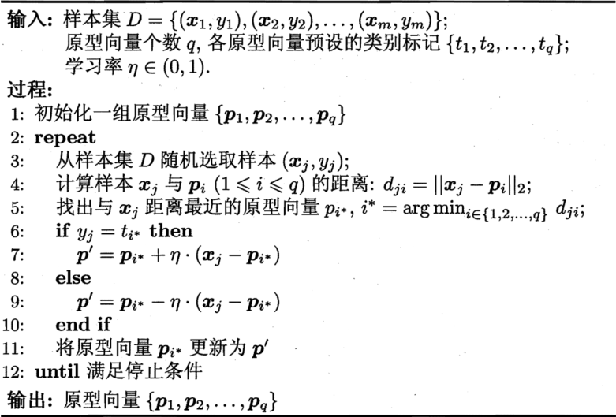

1. [聚类任务](clustering.ipynb)
2. 性能度量

    直观上看，我们希望“物以类聚”，即同一簇的样本尽可能彼此相似，不同簇的样本尽可能不同。换言之，聚类结果的“簇内相似度”高且“簇间相似度”低

3. 距离计算

    对函数$\mathrm{dist}(·, ·)$，若它是一个“距离度量”，则需满足一些基本性质：
    - 非负性：$\mathrm{dist}(\mathbf x_i, \mathbf x_j) \ge 0$
    - 同一性：$\mathrm{dist}(\mathbf x_i, \mathbf x_j) = 0$当且仅当$\mathbf x_i = \mathbf x_j$
    - 对称性：$\mathrm{dist}(\mathbf x_i, \mathbf x_j) = \mathrm{dist}(\mathbf x_j, \mathbf x_i)$
    - 直递性：$\mathrm{dist}(\mathbf x_i, \mathbf x_j) \le \mathrm{dist}(\mathbf x_i, \mathbf x_k) + \mathrm{dist}(\mathbf x_k, \mathbf x_j)$

    给定样本$\mathbf x_i = (x_{i1}; x_{i2}; \dots; x_{in})$与$\mathbf x_j = (x_{j1}; x_{j2}; \dots; x_{jn})$， 最常用的是“闵可夫斯基距离”$\mathrm{dist}_{\mathrm{mk}}(\mathbf x_j, \mathbf x_j) = (\sum_{u = 1}^n|x_{iu} - x_{ju}|^p)^{\frac1p}$

    $p = 2$时，闵可夫斯基距离即欧氏距离$\mathrm{dist}_{\mathrm{ed}}(\mathbf x_j, \mathbf x_j) = \|\mathbf x_i - \mathbf x_j\|_2 = \sqrt{\sum_{u = 1}^n|x_{iu} - x_{ju}|^2}$

    $p = 1$时，闵可夫斯基距离即曼哈顿距离$\mathrm{dist}_{\mathrm{man}}(\mathbf x_j, \mathbf x_j) = \|\mathbf x_i - \mathbf x_j\|_1 = \sum_{u = 1}^n|x_{iu} - x_{ju}|$
4. 原型聚类

    此类算法假设聚类结构能通过一组原型刻画，在现实聚类任务中极为常用。通常情形下，算法先对原型进行初始化，然后对原型进行迭代更新求解。采用不同的原型表示、不同的求解方式，将产生不同的算法
    
    1. [$k$均值算法](k-means.ipynb)
    2. 学习向量量化

        与$k$均值算法类似，“学习向量量化”也是试图找到一组原型向量来刻画聚类结构，但与一般聚类算法不同的是，LVQ假设数据样本带有类别标记，学习过程利用样本的这些监督信息来辅助聚类

        给定样本集$D = \{(\mathbf x_1, y_1), (\mathbf x_2, y_2), \dots, (\mathbf x_m, y_m)\}$，每个样本$\mathbf x_j$是由$n$个属性描述的特征向量$(x_{j1}; x_{j2}; \dots; x_{jn})$，$y_j \in \mathcal Y$是样本$\mathbf x_j$的类别标记。LVQ的目标是学得一组$n$维原型向量$\{\mathbf p_1, \mathbf p_2, \dots, \mathbf p_q\}$，每个原型向量代表一个聚类簇，簇标记$t_i \in \mathcal Y$
        
        $\mathbf p'$与$\mathbf x_j$之间的距离为$\|\mathbf p' - \mathbf x_j\|_2 = \|\mathbf p_{i^*} + \eta(\mathbf x_j - \mathbf p_{i^*}) - \mathbf x_j\|_2 = (1 - \eta)\|\mathbf p_{i^*} - \mathbf x_j\|_2$

        令学习率$\eta \in (0, 1)$，则原型向量$\mathbf p_{i^*}$在更新为$\mathbf p'$之后将更接近$\mathbf x_j$

        类似的，若$\mathbf p_{i^*}$与$\mathbf x_j$的类别标记不同，则更新后的原型向量与$\mathbf x_j$之间的距离将增大为$(1 + \eta)\|\mathbf p_{i^*} - \mathbf x_j\|$从而更远离$\mathbf x_j$

        在学得一组原型向量$\{\mathbf p_1, \mathbf p_2, \dots, \mathbf p_q\}$后，即可实现对样本空间$\mathcal X$的簇划分。对任意样本$\mathbf x$，它将被划入与其距离最近的原型向量所代表的簇中；换言之，每个原型向量$\mathbf p_i$定义了与之相关的一个区域$R_i$，该区域中每个样本与$\mathbf p_i$的距离不大于它与其他原型向量$\mathbf p_{i'}(i' \neq i)$的距离，即$R_i = \{\mathbf x \in \mathcal X | \|\mathbf x - \mathbf p_i\|_2 \leq \|\mathbf x - \mathbf p_{i'}\|_2, i' \neq i\}$由此形成了对样本空间$\mathcal X$的簇划分$\{R_1, R_2, \dots, R_q\}$，该划分通常称为“Voronoi剖分”
    3. [高斯混合聚类](gaussian_mixtures.ipynb)
6. [层次聚类](agglomerative_clustering.ipynb)

[返回](../readme.md)