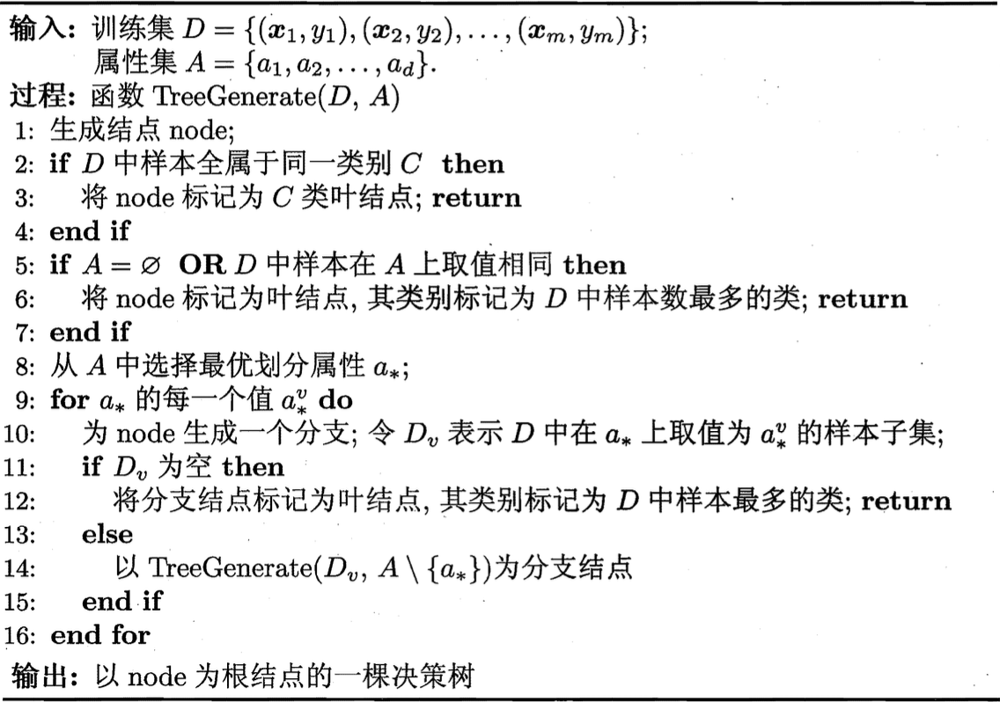

1. 基本流程
    
    显然，决策树的生成是一个递归过程。在决策树基本算法中，有三种情形会导致递归返回: 
    1. 当前结点包含的样本全属于同一类别，无需划分
    2. 当前属性集为空，或是所有样本在所有属性上取值相同，无法划分
    3. 当前结点包含的样本集合为空，不能划分

    在第2种情形下，我们把当前结点标记为叶结点，井将其类别设定为该结点所含样本最多的类别；在第3种情形下，同样把当前结点标记为叶结点，且将其类别设定为其父结点所含样本最多的类别。注意这两种情形的处理实质不同：情形2是在利用当前结点的后验分布，而情形3则是把父结点的样本分布作为当前结点的先捡分布
2. 划分选择
	1. 信息增益
	    - 信息熵：$\mathrm{Ent}(D) = -\sum_{k = 1}^{|\mathcal Y|}p_k\log_2p_k$
	    - 信息增益：$\mathrm{Gain}(D, a) = \mathrm{Ent}(D) - \sum_{v = 1}^V\frac{|D^v|}{|D|}\mathrm{Ent}(D^v) \Rightarrow a^\ast = \argmax_{a \in A}\mathrm{Gain}(D, a)$
	2. 增益率
		$$\mathrm{Gain\_ratio}(D, a) = \frac{\mathrm{Gain}(D, a)}{\mathrm{IV}(a)}, \mathrm{IV}(a) = -\sum_{v = 1}^V\frac{|D^v|}{|D|}\log_2\frac{|D^v|}{|D|}$$
	3. 基尼指数
		$$\mathrm{Gini}(D) = \sum_{k = 1}^{|\mathcal Y|}\sum_{k^\prime \neq k}p_kp_{k^\prime} = 1 - \sum_{k = 1}^{|\mathcal Y|}p_k^2$$
		直观来说，$\mathrm{Gini}(D)$反映了从数据集$D$中随机抽取两个样本，其类别标记不一致的概率。因此，$\mathrm{Gini}(D)$越小，则数据集$D$的纯度越高
		
		属性$a$的基尼指数定义为：$\mathrm{Gini\_index}(D, a) = \sum_{v = 1}^V\frac{|D^v|}{|D|}Gini(D^v) \Rightarrow a^\ast = \argmin_{a \in A}\mathrm{Gini\_index}(D, a)$
	4. 剪枝处理
		1. 预剪枝
			- 预剪枝是指在决策树生成过程中，对每个结点在划分前先进行估计，若当前结点的划分不能带来决策树泛化性能提升，则停止划分并将当前结点标记为叶结点
			- 预剪枝使得决策树的很多分支都没有“展开”试时间开销。但另一方面，有些分支的当前划分虽不能提升泛化性能、甚至可能导致泛化性能暂时下降，但在其基础上进行的后续划分却有可能导致性能显著提高；预剪枝基于“贪心”本质禁止这些分支展开，给预剪枝决策树带来了欠拟含的风险
		2. 后剪枝
			- 后剪枝是先从训练集生成一棵完整的决策树，然后自底向上地对非叶结点进行考察，若将该结点对应的子树替换为叶结点能带来决策树泛化性能提升，则将该子树替换为叶结点
			- 后剪枝决策树通常比预剪枝决策树保留了更多的分支。一般情形下，后剪枝决策树的欠拟合风险很小，泛化性能往往优于预剪枝决策树。但后剪枝过程是在生成完全决策树之后进行的，并且要自底向上地对树中的所有非叶结点进行逐一考察，因此其训练时间开销比未剪枝决策树和预剪枝决策树都要大得多
		
[返回](../readme.md)