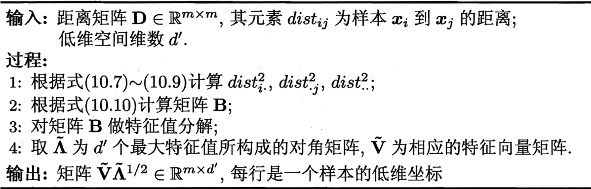

1. [k近邻学习](knn.ipynb)
2. 低维嵌入

    假定$m$个样本在原始空间的距离矩阵为$D \in \mathbb R^{m \times m}$，其第$i$行$j$列的元素$\mathrm{dist}_{ij}$为样本$\mathbf x_i$到$\mathbf x_j$的距离。我们的目标是获得样本在$d'$维空间的表示$Z \in \mathbb R^{d'\times m}$，$d' \le d$，且任意两个样本在$d'$维空间中的欧氏距离等于原始空间中的距离，即$\|\mathbf z_i - \mathbf z_j\| = \mathrm{dist}_{ij}$

    令$B = Z^\top Z \in \mathbb R^{m \times m}$，其中$B$为降维后样本的内积矩阵，$b_{ij} = \mathbf z_i^\top \mathbf z_j$，有$\mathrm{dist}_{ij}^2 = \|\mathbf z_i\|^2 + \|\mathbf z_j\|^2 - 2\mathbf z_i^\top\mathbf z_j = b_{ii} + b_{jj} - b_{ij}$

    为便于讨论，令降维后的样本$Z$被中心化，即$\sum_{i = 1}^m\mathbf z_i = \mathbf 0$。显然，矩阵$B$的行与列之和均为零，即$\sum_{i = 1}^mb_{ij} = \sum_{j = 1}^mb_{ij} = 0$。易知
    $$\begin{align*}& \sum_{i = 1}^m\mathrm{dist}_{ij}^2 = \mathrm{tr}(B) + mb_{jj} \\ & \sum_{j = 1}^m\mathrm{dist}_{ij}^2 = \mathrm{tr}(B) + mb_{jj} \\ & \sum_{i = 1}^m\sum_{j = 1}^m\mathrm{dist}_{ij}^2 = 2m\mathrm{tr}(B)\end{align*}$$

    令
    $$\begin{cases}& \mathrm{dist}_{i·}^2 = \frac1m\sum_{j = 1}^m\mathrm{dist}_{ij}^2 \\ & \mathrm{dist}_{·j}^2 = \frac1m\sum_{i = 1}^m\mathrm{dist}_{ij}^2 \\ & \mathrm{dist}_{··}^2 = \frac1{m^2}\sum_{i = 1}^m\sum_{j = 1}^m\mathrm{dist}_{ij}^2\end{cases} \Rightarrow b_{ij} = -\frac12(\mathrm{dist}_{ij}^2 - \mathrm{dist}_{i·}^2 - \mathrm{dist}_{·j}^2 + \mathrm{dist}_{··}^2)$$

    对矩阵$B$做特征值分解，$B = V\Lambda V^\top$，其中$\Lambda = \mathrm{diag}(\lambda_1, \lambda_2, \dots, \lambda_d)$为特征值构成的对角矩阵，$\lambda_1 \ge \lambda_2, \ge \dots \ge \lambda_d$，$V$为特征向量矩阵。假定其中有$d^*$个非零特征值，它们构成对角矩阵$\Lambda_* = \mathrm{diag}(\lambda_1, \lambda_2, \dots, \lambda_{d^*})$，令$V_*$表示相应的特征向量矩阵，则$Z$可表达为$Z = \Lambda_*^{1 / 2}V_*^\top \in \mathbb R^{d^* \times m}$

    在现实应用中为了有效降维，往往仅需降维后的距离与原始空间中的距离尽可能接近,而不必严格相等。此时可取$d' \ll d$个最大特征值构成对角矩阵$\tilde\Lambda = \mathrm{diag}(\lambda_1, \lambda_2, \dots, \lambda_{d'})$'，令$V$表示相应的特征向量矩阵，则$Z$可表达为$Z = \tilde\Lambda^{1 / 2}\tilde V^\top \in \mathbb R^{d' \times m}$

    一般来说，欲获得低维子空间，最简单的是对原始高维空间进行线性变换。给定$d$维空间中的样本$X = (\mathbf x_1, \mathbf x_2, \dots, \mathbf x_m) \in \mathbb R^{d \times m}$，变换之后得到$d' \le d$维空间中的样本$Z = W^\top X$，其中$W \in \mathbb R^{d \times d'}$是变换矩阵，$Z \in \mathbb R^{d'\times m}$是样本在新空间中的表达
3. [主成分分析](pca.ipynb)
6. 度量学习

    对两个$d$维样本$\mathbf x_i$和$\mathbf x_j$，它们之间的平方欧氏距离可写为$\mathrm{dist}_{\mathrm {ed}}^2(\mathbf x_i, \mathbf x_j) = \|\mathbf x_i - \mathbf x_j\|_2^2 = dist_{ij, 1}^2 + dist_{ij, 2}^2 + \dots + dist_{ij, d}^2$，其中$dist_{ij, k}$表示$\mathbf x_i$与$\mathbf x_j$在第$k$维上的距离。若假定不同属性的重要性不同，则可引入属性权重$\mathbf w$，得到$\mathrm{dist}_{\mathrm {wed}}^2(\mathbf x_i, \mathbf x_j) = w_1dist_{ij, 1}^2 + w_2dist_{ij, 2}^2 + \dots + w_ddist_{ij, d}^2 = (\mathbf x_i - \mathbf x_j)^\top W(\mathbf x_i - \mathbf x_j)$，其中$w_i \ge 0$，$W = \mathrm{diag}(\mathbf w)$是一个对角矩阵，$(W)_{ii} = w_i$
    - 马氏距离：$\mathrm{dist}_{\mathrm {mah}}^2(\mathbf x_i, \mathbf x_j) = (\mathbf x_i - \mathbf x_j)^\top M(\mathbf x_i - \mathbf x_j) = \|\mathbf x_i - \mathbf x_j\|_M^2$

    注意到为了保持距离非负且对称，$M$必须是（半）正定对称矩阵，即必有正交基$P$使得$M$能写为$M = PP^\top$

    近邻分类器在进行判别时通常使用多数投票法，邻域中的每个样本投1票，邻域外的样本投0票。不妨将其替换为概率投票法。对于任意样本$\mathbf x_j$，它对$\mathbf x_i$分类结果影响的概率为$p_{ij} = \frac{\exp(-\|\mathbf x_i - \mathbf x_j\|_M^2)}{\sum_l\exp(-\|\mathbf x_i - \mathbf x_j\|_M^2)}$。若以留一法正确率的最大化为目标，则可计算$\mathbf x_i$的留一法正确率，即它被自身之外的所有样本正确分类的概率为$p_i = \sum_{j \in \Omega_i}p_{ij}$

    其中$\Omega_i$表示与$\mathbf x_i$属于相同类别的样本的下标集合。于是，整个样本集上的留一法正确率为$\sum_{i = 1}^mp_i = \sum_{i = 1}^m\sum_{j \in \Omega_i}p_{ij}$

    $$\min_P 1 - \sum_{i = 1}^m\sum_{j \in \Omega_i}\frac{\exp(-\|P^\top\mathbf x_i - P^\top\mathbf x_j\|_M^2)}{\sum_l\exp(-\|P^\top\mathbf x_i - P^\top\mathbf x_j\|_M^2)}$$

    实际上，我们不仅能把错误率这样的监督学习目标作为度量学习的优化目标，还能在度量学习中引入领域知识。例如，若己知某些样本相似、某些样本不相似，则可主义“必连”约束集合$M$与“勿连” 约束集合$\mathcal C$，$(\mathbf x_i, \mathbf x_j) \in \mathcal M$表示$\mathbf x_i$与$x_j$相似，$(\mathbf x_i, \mathbf x_k) \in \mathcal C$表示$\mathbf x_i$与$\mathbf x_k$不相似。显然，我们希望相似的样本之间距离较小，不相似的样本之间距离较大，于是可通过求解下面这个凸优化问题获得适当的度量矩阵$M$：$\min_M\sum_{(\mathbf x_i, \mathbf x_j) \in \mathcal M}\|\mathbf x_i - \mathbf x_j\|_M^2$ s.t. $\sum_{(\mathbf x_i, \mathbf x_k) \in \mathcal C}\|\mathbf x_i - \mathbf x_k\|_M^2 \ge 1$, $M \succeq 0$

    不同的度量学习方法针对不同目标获得“好”的半正定对称距离度量矩阵$M$，若$M$是一个低秩矩阵，则通过对$M$进行特征值分解，总能找到一组正交基，其正交基数目为矩阵$M$的秩$\mathrm{rank}(M)$，小于原属性数$d$。于是，度量学习学得的结果可衍生出一个降维矩阵$P \in \mathbb R^{\mathrm{rank(M)}}$，能用于降维之目的

[返回](../readme.md)