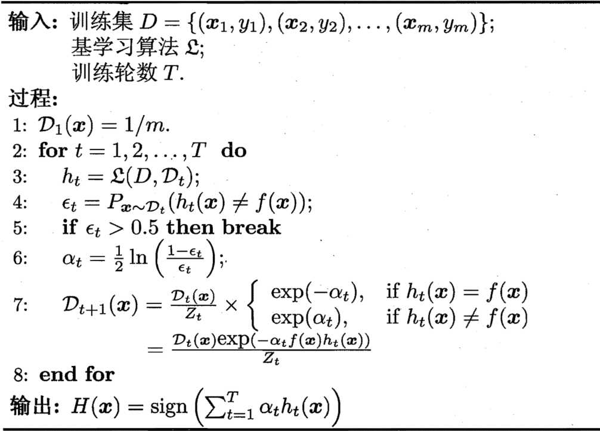

1. 个体与集成

    - 一般结构：先产生一组“个体学习器”，再用某种策略将它们结合起来。个体学习器通常由一个现有的学习算法从训练数据产生

    同质集成中的个体学习器亦称“基学习器”，相应的学习算法称为“基学习算法”。集成也可包含不同类型的个体学习器，例如同时包含决策树和神经网络，这样的集成是“异质”的。异质集成中的个体学习器由不同的学习算法生成，这时就不再有基学习算法

    要获得好的集成，个体学习器应“好而不同”，即个体学习器要有一定的“准确性”，即学习器不能太坏，并且要有“多样性”，即学习器间具有差异

    $$
    \begin{cases}
        P(h_i(x) \neq f(x)) = \epsilon \\
        H(x) = \mathrm{sign}(\sum_{i = 1}^Th_i(x))
    \end{cases}
    \Rightarrow P(H(x) \neq f(x)) = \sum_{k = 0}^{\lfloor T / 2\rfloor}{T\choose k}(1 - \epsilon)^k\epsilon^{T - k} \leq \exp(-\frac12T(1 - 2\epsilon)^2)$$
2. [Boosting](gradient_boosting.ipynb)

    先从初始训练集训练出一个基学习器，再根据基学习器的表现对训练样本分布进行调整，使得先前基学习器做错的训练样本在后续受到更多关注，然后基于调整后的样本分布来训练下一个基学习器；如此重复进行，直至基学习器数目达到事先指定的值$T$，最终将这$T$个基学习器进行加权结合
    - [AdaBoost](adaboost.ipynb)
        
        - 加性模型：$H(\mathbf x) = \sum_{t = 1}^T\alpha_th_t(\mathbf x)$
            $$l_{\mathrm{exp}}(H | \mathcal D) = \mathbb E_{\mathbf x \sim \mathcal D}[e^{-f(\mathbf x)H(\mathbf x)}] \Rightarrow \frac{\partial l_{\mathrm{exp}}(H | \mathcal D)}{\partial H(\mathbf x)} = -e^{H(\mathbf x)}P(f(x) = 1 | \mathbf x) + e^{H(\mathbf x)}P(f(x) = -1 | \mathbf x) \Rightarrow H(\mathbf x) = \frac12\ln\frac{P(f(\mathbf x) = 1 | \mathbf x)}{P(f(\mathbf x) = -1 | \mathbf x)} \Rightarrow \mathrm{sign}(H(\mathbf x)) = \mathrm{sign}(\frac12\ln\frac{P(f(\mathbf x) = 1 | \mathbf x)}{P(f(\mathbf x) = -1 | \mathbf x)}) =
            \begin{cases}
                1, P(f(\mathbf x) = 1 | \mathbf x) > P(f(\mathbf x) = -1 | \mathbf x) \\
                -1, P(f(\mathbf x) = 1 | \mathbf x) < P(f(\mathbf x) = -1 | \mathbf x)
            \end{cases}
            = \argmax_{y \in \{-1, 1\}}P(f(\mathbf x) = y | \mathbf x)$$
            $$l_{\mathrm{exp}}(\alpha_th_t | \mathcal D_t) = \mathbb E_{\mathbf x \sim \mathcal D_t}[e^{-f(\mathbf x)\alpha_th_t(\mathbf x)}] = \mathbb E_{\mathbf x \sim \mathcal D_t}[e^{-\alpha_t}\mathbb I(f(\mathbf x) = h_t(\mathbf x)) + e^{\alpha_t}\mathbb I(f(\mathbf x) \neq h_t(\mathbf x))] = e^{-\alpha_t}P_{\mathbf x \sim \mathcal D_t}(f(\mathbf x) = h_t(\mathbf x)) + e^{\alpha_t}P_{\mathbf x \sim \mathcal D_t}(f(\mathbf x) \neq h_t(\mathbf x)) = e^{-\alpha_t}(1 - \epsilon_t) + e^{\alpha_t}\epsilon_t \Rightarrow \frac{\partial l_{\mathrm{exp}}(\alpha_th_t | \mathcal D_t)}{\partial\alpha_t} = -e^{\alpha_t}(1 - \epsilon_t) + e^{\alpha_t}\epsilon_t \Rightarrow \alpha_t = \frac12\ln(\frac{1 - \epsilon_t}{\epsilon_t})$$
            $$
            \begin{cases}
                \begin{cases}
                    l_{\mathrm{exp}}(H_{t - 1} + h_t | \mathcal D) = \mathbb E_{\mathbf x \sim \mathcal D}[e^{-f(\mathbf x)(H_{t - 1}(\mathbf x) + h_t(\mathbf x))}] = \mathbb E_{\mathbf x \sim \mathcal D}[e^{-f(\mathbf x)H_{t - 1}(\mathbf x)}e^{-f(\mathbf x)h_t(\mathbf x)}] \simeq E_{\mathbf x \sim \mathcal D}[e^{-f(\mathbf x)H_{t - 1}(\mathbf x)}(1 - f(\mathbf x)h_t(\mathbf x) + \frac{f^2(\mathbf x)h_t^2(\mathbf x)}2)] = E_{\mathbf x \sim \mathcal D}[e^{-f(\mathbf x)H_{t - 1}(\mathbf x)}(1 - f(\mathbf x)h_t(\mathbf x) + \frac12)] \Rightarrow h_t(\mathbf x) = \argmin_h l_{\mathrm{exp}}(H_{t - 1} + h | \mathcal D) = \argmin_h E_{\mathbf x \sim \mathcal D}[e^{-f(\mathbf x)H_{t - 1}(\mathbf x)}(1 - f(\mathbf x)h_t(\mathbf x) + \frac12)] = \argmax_h E_{\mathbf x \sim \mathcal D}[e^{-f(\mathbf x)H_{t - 1}(\mathbf x)}f(\mathbf x)h_t(\mathbf x)] = \argmax_h\mathbb E_{\mathbf x \sim \mathcal D}[\frac{e^{-f(\mathbf x)H_{t - 1}(\mathbf x)}}{\mathbb E_{\mathbf x \sim \mathcal D}[e^{-f(\mathbf x)H_{t - 1}(\mathbf x)}]}f(\mathbf x)h(\mathbf x)] \\
                    \mathcal D_t(\mathbf x) = \frac{\mathcal D(\mathbf x)e^{-f(\mathbf x)H_{t - 1}(\mathbf x)}}{\mathbb E_{\mathbf x \sim \mathcal D}[e^{-f(\mathbf x)H_{t - 1}(\mathbf x)}]}
                \end{cases}
                \Rightarrow h_t(\mathbf x) = \argmax_h\mathbb E_{\mathbf x \sim \mathcal D_t}[f(\mathbf x)h(\mathbf x)] \\
                f(\mathbf x)h(\mathbf x) = 1 - 2\mathbb I(f(\mathbf x) \neq h(\mathbf x))
            \end{cases}
            \Rightarrow h_t(\mathbf x) = \argmin_h\mathbb E[\mathbb I(f(\mathbf x) \neq h(\mathbf x))]$$
            $$\mathcal D_{t + 1}(\mathbf x) = \frac{\mathcal D(\mathbf x)e^{-f(\mathbf x)H_t(\mathbf x)}}{\mathbb E_{\mathbf x \sim \mathcal D}[e^{-f(\mathbf x)H_t(\mathbf x)}]} = \frac{\mathcal D(\mathbf x)e^{-f(\mathbf x)H_{t - 1}(\mathbf x)}e^{-f(\mathbf x)\alpha_th_t(\mathbf x)}}{\mathbb E_{\mathbf x \sim \mathcal D}[e^{-f(\mathbf x)H_t(\mathbf x)}]} = \mathcal D(\mathbf x)e^{-f(\mathbf x)\alpha_th_t(\mathbf x)}\frac{\mathbb E_{\mathbf x \sim \mathcal D}[e^{-f(\mathbf x)H_{t - 1}(\mathbf x)}]}{\mathbb E_{\mathbf x \sim \mathcal D}[e^{-f(\mathbf x)H_t(\mathbf x)}]}$$
    从偏差——方差分解的角度看，Boosting主要关住降低偏差，因此Boosting能基于泛化性能相当弱的学习器构建出很强的集成
3. Bagging与随机森林
    1. [Bagging](bagging.ipynb)
    2. [随机森林](random_forest.ipynb)
4. 结合策略

[返回](../readme.md)