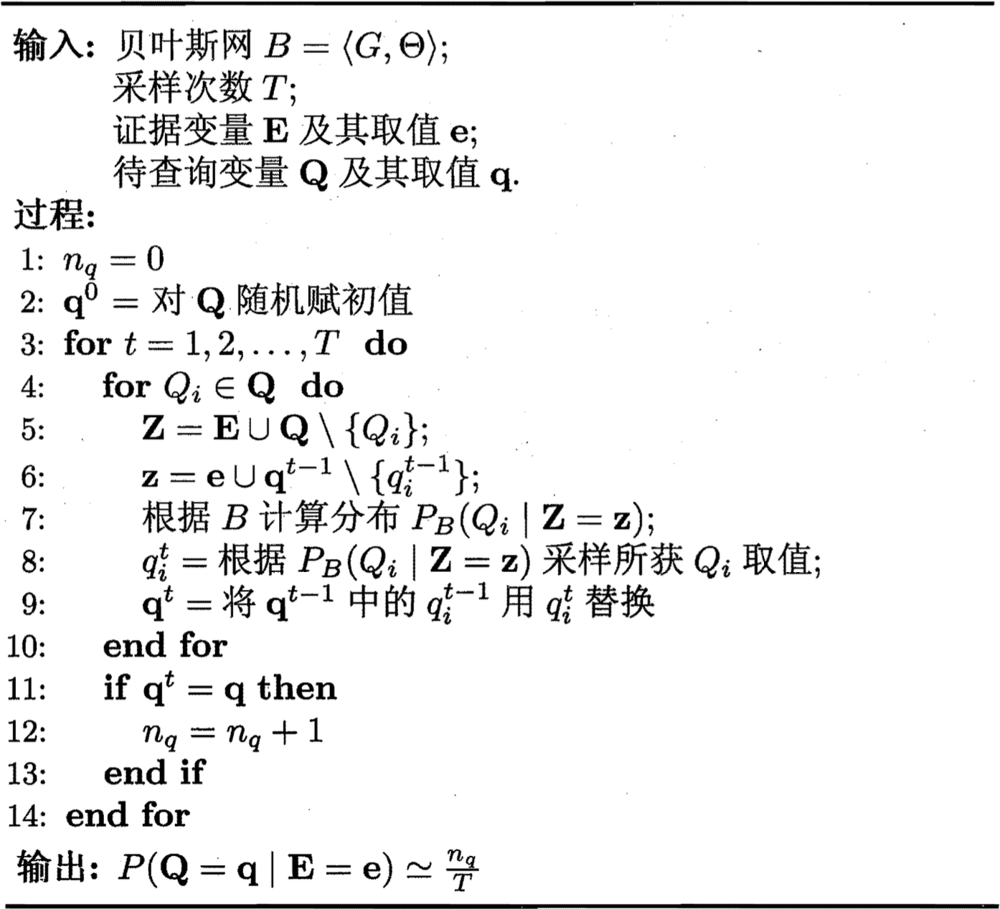

1. 贝叶斯网
    1. 结构
        $$P_B(x_1, x_2, .., x_d) = \prod_{i = 1}^dP_B(x_i | \pi_i) = \prod_{i = 1}^d\theta_{x_i | \pi_i}$$
        ```mermaid
		graph
			subgraph 同父结构
			x11((x1))
			
			x11 --> x3((x3))
			x11 --> x41((x4))
			end
			subgraph V型结构
			x42((x4))
			
			x1((x1)) --> x42
			x2((x2)) --> x42
		    end
		    subgraph 顺序结构
			x((x))
			
			x --> y((y))
			z((z)) --> x
		    end
		```
        在“同父”结构中，给定父节点$x_1$的取值，则$x_3$与$x_4$条件独立。在“顺序”结构中，给定$x$的值，则$y$与$z$条件独立。V型结构亦称“冲撞”结构，给定子节点$x_4$的取值，$x_1$与$x_2$必不独立；奇妙的是，若$x_4$的取值完全未知，则V型结构下$x_1$与$x_2$却是相互独立的
        $$P(x_1, x_2) = \sum_{x_4}P(x_1, x_2, x_4) = \sum_{x_4}P(x_4 | x_1, x_2)P(x_1)P(x_2) = P(x_1)P(x_2)$$
        这样的独立性称为“边际独立性”，记为$x_1\perp\!\!\!\perp x_2$
        
        为了分析有向图中变量间的条件独立性，可使用“有向分离”：
	        - 找出有向图中的所有V型结构，在V型结构的两个父结点之间加上一条无向边
	        - 将所有有向边改为无向边
		由此产生的无向图成为“道德图”，令父结点相连的过程称为“道德化”
		假定道德图中有变量$x$，$y$和变量集合$\mathbf z = {z_i}$，若变量$x$和$y$能在图上被$\mathbf z$分开，即道德图中将变量集合$\mathbf z$去除后，$x$和$y$分属两个连通分支，则称变量$x$和$y$被$\mathbf z$有向分离，$x \perp y | \mathbf z$成立。
	2. 学习

		我们先定义一个评分函数，以此来评估贝叶斯网与训练数据的契合程度，然后基于这个评分函数来寻找结构最优的贝叶斯网
		$$s(B | D) = f(\theta)|B| - LL(B | D)$$
		中，$|B|$是贝叶斯网的参数个数；$f(\theta)$表示描述每个参数$\theta$所需的字节数；而$LL(B | D) = \sum_{i = 1}^m\log P_B(\mathbf x_i)$
		- AIC评分函数：$f(\theta) = 1 \Rightarrow AIC(B | D) = |B| - LL(B| D)$
		- BIC评分函数：$f(\theta) = \frac12\log m \Rightarrow BIC(B | D) = \frac{\log m}2|B| - LL(B | D)$
		$$\theta_{x_i | \pi_i} = \hat P_D(x_i | \pi_i)$$
	3. 推断
		
		吉布斯采样算法先随机产生一个与证据$E = \mathbf e$一致的样本$\mathbf q^0$作为初始点，然后每步从当前样本出发产生下一个样本。具体来说，在第$t$次采样中，算法先假设$\mathbf q^t = \mathbf q^{t - 1}$，然后对非证据变量逐个进行采样改变其取值，采样概率根据贝叶斯网B和其他变量的当前取值（即$Z = \mathbf z$）计算获得。假定经过$T$次采样得到的与$\mathbf q$一致的样本共有$n_q$个，则可近似估算出后验概率$P(Q = \mathbf q | E = \mathbf e) \simeq \frac{n_q}T$
		
		需注意的是，由于马尔可夫链通常需很长时间才能趋于平稳分布，因此吉布斯采样算法的收敛速度较慢。此外，若贝叶斯网中存在极端概率“0”或“1”，则不能保证马尔可夫链存在平稳分布，此时吉布斯采样会给出错误的估计结果
2. 隐马尔可夫模型
    $$P(x_1, y_1, ..., x_n, y_n) = P(y_1)P(x_1 | y_1)\prod_{i = 2}^nP(y_i | y_{i - 1})P(x_i | y_i)$$
    - 状态转移概率：$a_{ij} = P(y_{t + 1} = s_j | y_t = s_i), 1 \leq i, j \leq N$
    - 输出观测概率：$b_{ij} = P(x_t = o_j | y_t = s_i), 1 \leq i \leq N, 1 \leq i \leq N, i \leq j \leq M$
    - 初始状态概率：$\pi_i = P(y_1 = s_i)$
3. 马尔可夫随机场 
	```mermaid
	graph
		x1((x1))
		x2((x2))
		x3((x3))
		x5((x5))
		x6((x6))
		
		x1 --- x2
		x1 --- x3
		x2 --- x4((x4))
		x2 --- x5
		x2 --- x6
		x3 --- x5
		x5 --- x6
	```
	- 对于$n$个变量$\mathbf x = \{x_1, x_2, ..., x_n\}$，所有团构成的集合为$\mathcal C$，与团$Q \in \mathcal C$对应的变量集合记为$\mathbf x_Q$，则联合概率定义为$P(\mathbf x) = \frac1Z\prod_{Q \in \mathcal C}\psi_Q(\mathbf x_Q) \Rightarrow P(\mathbf x) = \frac1{Z^*}\prod_{Q \in \mathcal C^*}\psi_Q(\mathbf x_Q)$，其中$\psi_Q$为与团$Q$对应的势函数，用于对团$Q$中的变量关系进行建模，极大团构成的集合为$\mathcal C^*$，$Z^* = \sum_{\mathbf x}\prod_{Q \in \mathcal C^*}\psi_Q(\mathbf x_Q)$为规范化因子
	- 全局马尔可夫性：给定两个变量子集的分离集，则这两个变量子集条件独立
		```mermaid
		graph
		xC((xC))
		
		xA((xA)) --- xC
		xB((xB)) --- xC
		```
		$$P(x_A, x_B, x_C) = \frac1Z\psi_{AC}(x_A, x_C)\psi_{BC}(x_B, x_C) \Rightarrow P(x_A, x_B | x_C) = P(x_A | x_C)P(x_B | x_C)$$
	- 局部马尔可夫性：给定某变量的邻接变量，则该变量条件独立于其他变量。形式化地说，令$V$为图的结点集，$n(v)$为结点$v$在图上的邻接结点，$n^*(v) = n(v) \cup \{v\}$，有$\mathbf x_v \perp \mathbf x_{V \setminus n^*(v)} | \mathbf x_{n(v)}$
	- 成对马尔可夫性：给定所有其他变量，两个非邻接变量条件独立。形式化地说，令为图的结点集和边集分别为$V$和$E$，对图中的两个结点$u$和$v$，若$\langle u, v\rangle \notin E$，则$\mathbf x_u \perp \mathbf x_v | \mathbf x_{V \setminus \langle u, v\rangle}$
	
	为了满足非负性，指数函数常被用于定义势函数，即$\psi_Q(\mathbf x_Q) = e^{-H_Q(\mathbf x_Q)}$
	
	$H_Q(\mathbf x_Q)$是一个定义在变量$\mathbf x_Q$上的实值函数，常见形式为$H_Q(\mathbf x_Q) = \sum_{u, v \in Q, u \neq v}\alpha_{uv}x_ux_v + \sum_{v \in Q}\beta_vx_v$
4. 条件随机场
5. 学习与推断

	具体来说，假设图模型所对应的变量集$\mathbf x = \{x_1, x_2, \dots, x_N\}$能分为$\mathbf x_E$和$\mathbf x_F$两个不相交的变量集，推断问题的目标就是计算边际概率$P(\mathbf x_F)$或条件概率$P(\mathbf x_F | \mathbf x_E)$。由条件概率定义有$P(\mathbf x_F | \mathbf x_E) = \frac{P(\mathbf x_E, \mathbf x_F)}{P(\mathbf x_E)} = \frac{P(\mathbf x_E, \mathbf x_F)}{\sum_{\mathbf x_F}P(\mathbf x_E, \mathbf x_F)}$，其中联合概率$P(\mathbf x_E, \mathbf x_F)$可基于概率图模型获得，因此，推断问题的关键就是如何高效地计算边际分布，即$P(\mathbf x_F) = \sum_{\mathbf x_F}P(\mathbf x_E, \mathbf x_F)$
	
	1. 变量消去
		```mermaid
		graph LR
			x2((x2))
			x3((x3))

			x1((x1)) --> x2
			x2 --> x3
			x3 --> x4((x4))
			x3 --> x5((x5))
		```
		$$P(x_5) = \sum_{x_4}\sum_{x_3}\sum_{x_2}\sum_{x_1}P(x_1, x_2, x_3, x_4, x_5) = \sum_{x_4}\sum_{x_3}\sum_{x_2}\sum_{x_1}P(x_1)P(x_2 | x_1)P(x_3 | x_2)P(x_4 | x_3)P(x_5 | x_3) = \sum_{x_3}P(x_5 | x_3)\sum_{x_4}P(x_4 | x_3)\sum_{x_2}P(x_3 | x_2)\sum_{x_1}P(x_1)P(x_2 | x_1) = \sum_{x_3}P(x_5 | x_3)\sum_{x_4}P(x_4 | x_3)\sum_{x_2}P(x_3 | x_2)m_{12}(x_2) = \sum_{x_3}P(x_5 | x_3)\sum_{x_4}P(x_4 | x_3)m_{23}(x_3) = \sum_{x_3}P(x_5 | x_3)m_{23}(x_3)\sum_{x_4}P(x_4 | x_3) = \sum_{x_3}P(x_5 | x_3)m_{23}(x_3)m_{43}(x_3) = m_{35}(x_5)$$
		事实上，上述方法对无向图模型同样适用
		$$P(x_1, x_2, x_3, x_4, x_5) = \frac1Z\psi_{12}(x_1, x_2)\psi_{23}(x_2, x_3)\psi_{34}(x_3, x_4)\psi_{35}(x_3, x_5) \Rightarrow P(x_5) = \frac1Z\sum_{x_3}\psi_{35}(x_3, x_5)\sum_{x_4}\psi_{34}(x_3, x_4)\sum_{x_2}\psi_{23}(x_2, x_3)\sum_{x_1}\psi_{12}(x_1, x_2) = \frac1Z\sum_{x_3}\psi_{35}(x_3, x_5)\sum_{x_4}\psi_{34}(x_3, x_4)\sum_{x_2}\psi_{23}(x_2, x_3)m_{12}(x_2) = \dots = \frac1Zm_{35}(x_5)$$
		变量消去法有一个明显的缺点：若需计算多个边际分布，重复使用变量消去法将会造成大量的冗余计算
	2. 信念传播

		信念传播算法将变量消去法中的求和操作看作一个消息传递过程，较好地解决了求解多个边际分布时的重复计算问题。具体来说，变量消去法通过求和操作$m_{ij}(x_j) = \sum_{x_i}\psi(x_i, x_j)\prod_{k \in n(i) \setminus j}m_{ki}(x_i)$消去变量$x_i$，其中$n(i)$表示结点$x_i$的邻接结点。在信念传播算法中，这个操作被看作从$x_i$向$x_j$传递了一个消息$m_{ij}(x_j)$

		在信念传播算法中，一个结点仅在接收到来自其他所有结点的消息后才能向另一个结点发送消息，且结点的边际分布正比于它所接收的消息的乘积，即$P(x_i) \propto \prod_{k \in n(i)}m_{ki}(x_i)$

		若图结构中没有环，则信念传播算法经过两个步骤即可完成所有消息传递，进而能计算所有变量上的边际分布：
		- 指定一个根结点，从所有叶结点开始向根结点传递消息，直到根结点收到所有邻接结点的消息
		- 从根结点开始向叶结点传递消息，直到所有叶结点均收到消息
		```mermaid
		graph
		subgraph 消息传向根结点
			x21((x2))
			x31((x3))

			x21 --> |"m21(x1)"| x11((x1)) 
			x31 --> |"m32(x2)"| x21
			x41((x4)) --> |"m43(x3)"| x31
			x51((x5)) --> |"m53(x3)"| x31
		end
		subgraph 消息从根结点传出
			x22((x2))
			x32((x3))

			x12((x1)) --> |"m12(x1)"| x22
			x22 --> |"m23(x3)"| x32
			x32 --> |"m34(x4)"| x42((x4))
			x32 --> |"m35(x5)"| x52((x5)) 
		end
		```

[返回](../readme.md)